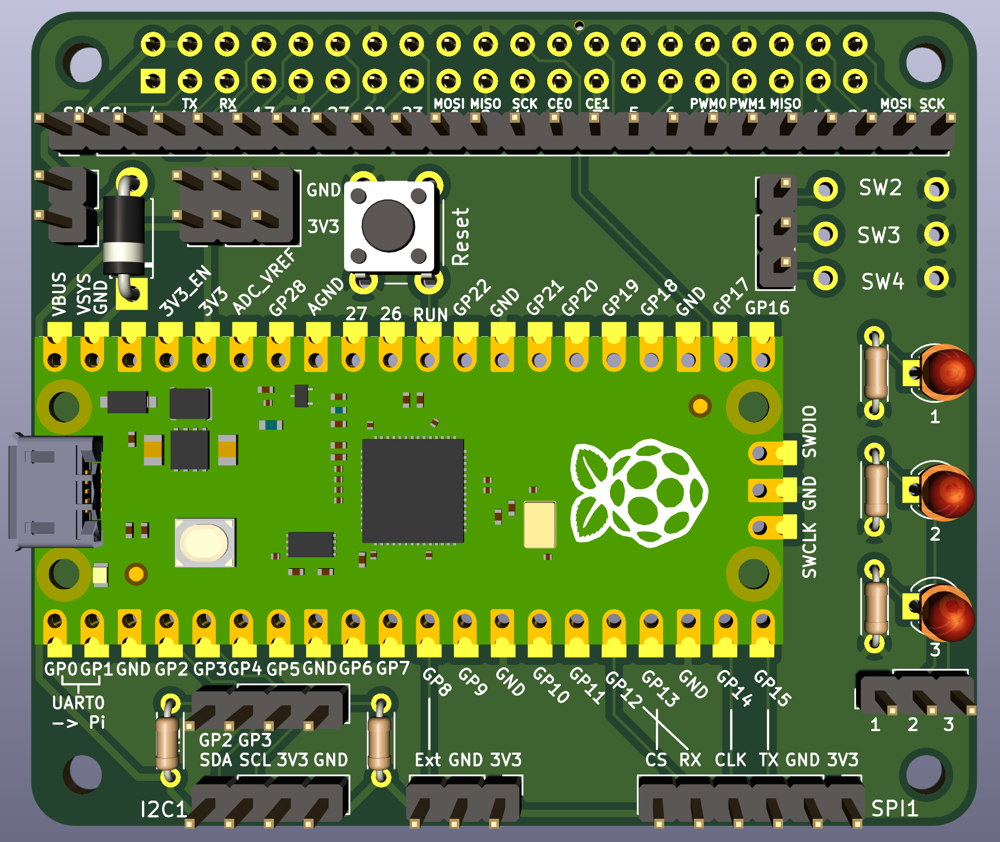
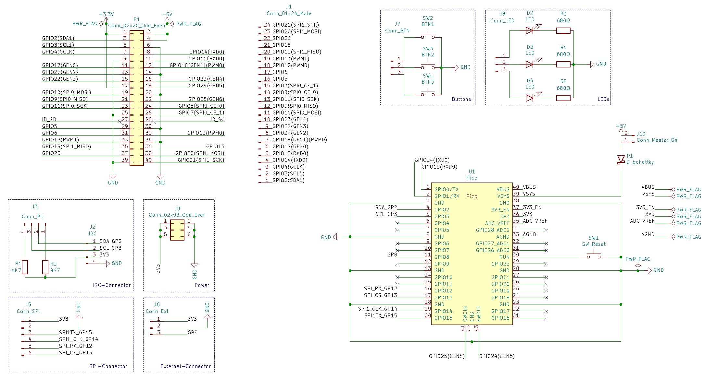

Pi-Pico-Devboard-Hat
====================

This repository contains the KiCAD project files of a Pico development hat.

The hat connects power, UART0 and the debug-port of the pico to the
respective pins of the Pi. You will also find a number of buttons, LEDs,
an I2C-connector with pullups (controlled by jumpers), and an SPI-connector.

The design uses only through-hole components, so soldering should be easy.
The Pico is soldered directly to the hat, thanks to the castellated holes
this is no major problem. Just watch out that you don't accidently fill
the holes if you also want to attach headers directly to the Pico (which
you most certainly want to do).

Schematic
---------

Layout
------

License
-------

Shield: [![CC BY-SA 4.0][cc-by-sa-shield]][cc-by-sa]

This work is licensed under a
[Creative Commons Attribution-ShareAlike 4.0 International
License][cc-by-sa].

[![CC BY-SA 4.0][cc-by-sa-image]][cc-by-sa]

[cc-by-sa]: http://creativecommons.org/licenses/by-sa/4.0/
[cc-by-sa-image]: https://licensebuttons.net/l/by-sa/4.0/88x31.png
[cc-by-sa-shield]:
https://img.shields.io/badge/License-CC%20BY--SA%204.0-lightgrey.svg
